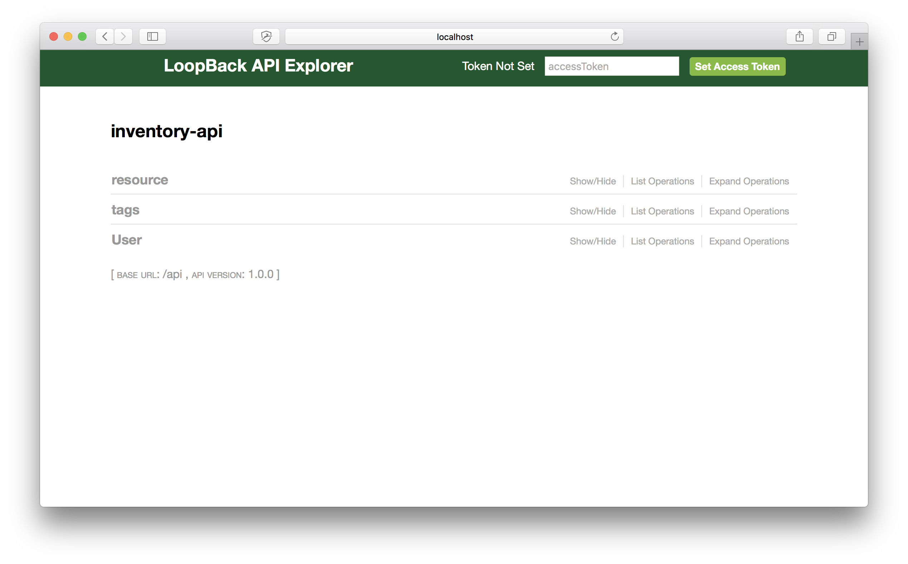
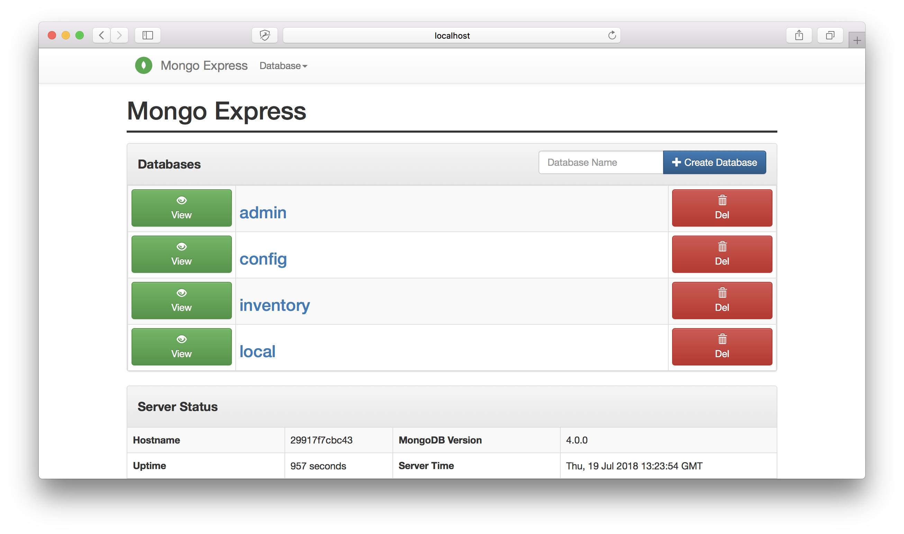

# inventory-api

## Source
Inspired from :
https://medium.freecodecamp.org/build-restful-api-with-authentication-under-5-minutes-using-loopback-by-expressjs-no-programming-31231b8472ca

## Objective
Application to store resources, tags and relations between both.

Backend is a NodeJS RestFull API server and objects are stored in a MongoDB storage. 

The whole application is packaged in a docker stack for easy deployment. 

## Usage
### Deploy
Use script to deploy the docker stack :
```
./deploy.sh
```
It first builds the image of inventory-api service. 

### Access
* Swagger explorer : http://swarm-ip:3000/explorer
* mongo-express : http://swarm-ip:8081




### Remove
Use command line to remove the stack :
```
docker stack rm inventory
```

